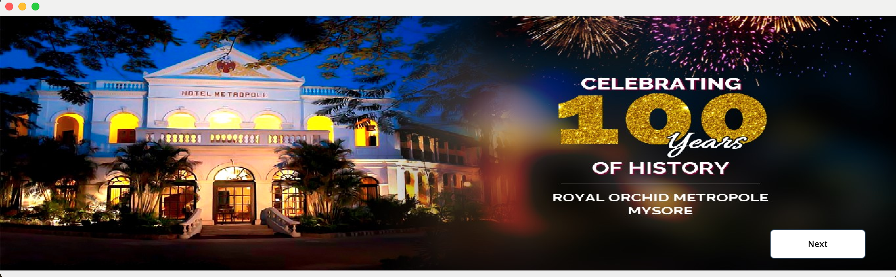
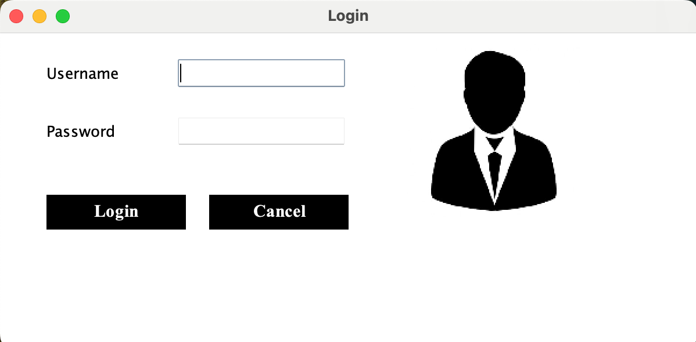
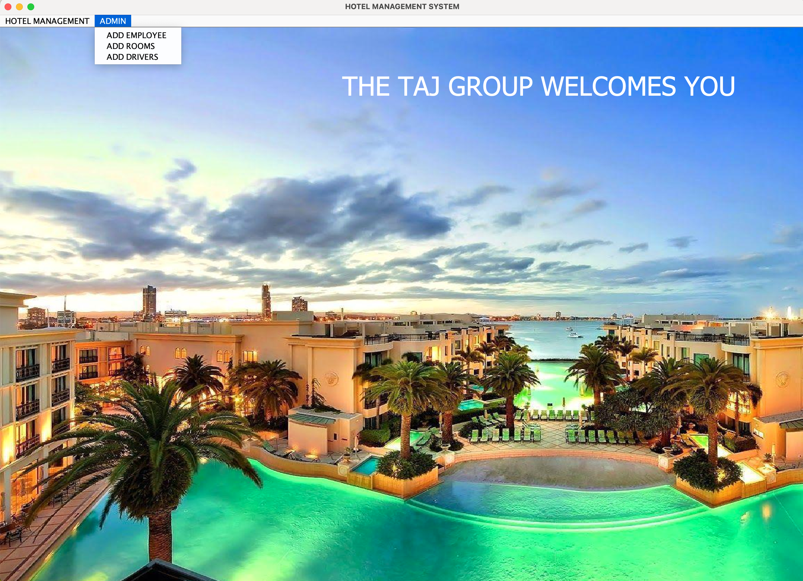
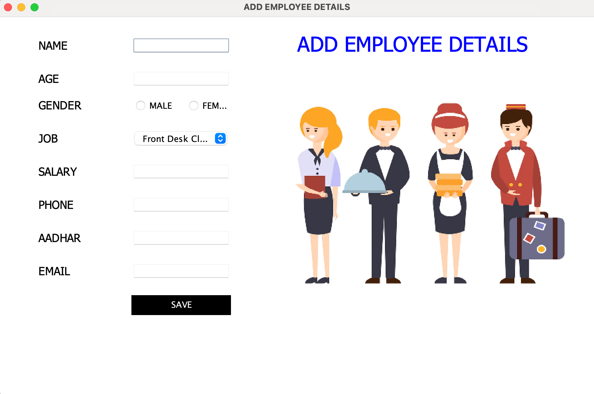

# Hotel Management System

This is a Java-based Hotel Management System built using Java Swing for the front-end and JDBC for database connectivity. The system allows the management of hotel rooms, employees, customers, and various other departments. The project is designed to handle key operations like room allocation, employee details, customer check-in/out, and other hotel services.

## Features

- **Room Management**: Add, update, and manage room availability.
- **Customer Management**: Register new customers and handle check-ins and check-outs.
- **Employee Management**: Add and manage employee details.
- **Department Management**: View and manage hotel departments.
- **Search and Reports**: Search for rooms, customers, and employees with ease.
- **Interactive GUI**: Built using Java Swing for a responsive and intuitive user interface.
- **Database Connectivity**: Integrated with MySQL using JDBC for persistent storage of data.
## Project Structure

Here’s an overview of the core files and their functionalities:

| File Name             | Description |
|-----------------------|-------------|
| `AddDrivers.java`      | Handles adding new drivers for hotel services. |
| `AddEmployee.java`     | Manages the addition of new employees to the hotel system. |
| `AddRoom.java`         | Handles the addition of new rooms into the system. |
| `CheckOut.java`        | Manages the process of checking out customers from the hotel. |
| `conn.java`            | Handles database connections using JDBC. |
| `CustomerInfo.java`    | Displays information about the customers staying at the hotel. |
| `Dashboard.java`       | Main dashboard that links to different modules like room management, employee management, etc. |
| `Department.java`      | Manages the hotel departments and their information. |
| `Employee.java`        | Displays employee details and information. |
| `HotelManagementSystem.java` | Main class to launch the Hotel Management System. |
| `Login.java`           | Handles user login functionality. |
| `ManagerInfo.java`     | Displays information about the hotel manager. |
| `NewCustomer.java`     | Registers a new customer and assigns them a room. |
| `PickUp.java`          | Manages transportation and pickup services for guests. |
| `Reception.java`       | Reception dashboard linking to customer and room management. |
| `Room.java`            | Displays the available rooms and their details. |
| `SearchRoom.java`      | Allows searching for available rooms. |
| `UpdateCheck.java`     | Handles the update of customer check-in details. |
| `UpdateRoom.java`      | Manages the update of room availability and status. |

## Requirements

- **Java Development Kit (JDK)** 8 or higher
- **MySQL Database** (Make sure to set up the database)
- **MySQL JDBC Driver** (e.g., `mysql-connector-java-8.0.26.jar`)
- **rs2xml.jar** (For handling `ResultSet` to `JTable` conversions)
## Setup and Installation
### 1. Clone the Repository
```bash
git clone https://github.com/csworm-rudraksha/hotel-management-system.git
cd hotel-management-system 
```
### 2. Database Setup
- Create a MySQL database named **hotelmanagementsystem**.
- Import the SQL script (if available) to set up the necessary tables.
- You can create the database using:
```bash 
CREATE DATABASE hotelmanagementsystem;
USE hotelmanagementsystem;
```
- Update the conn.java file with your MySQL credentials:

### 3. Add Libraries
Ensure that the following libraries are included in your project:

- mysql-connector-java-x.x.x.jar (for MySQL connectivity)
- rs2xml.jar (for displaying ResultSets in JTable)

## Technology used

- **Java Swing**: For the user interface.
- **JDBC (Java Database Connectivity)**: For database interactions.
- **MySQL**: For database management.
- **rs2xml**: For populating JTable with ResultSet data.

## Screenshots









